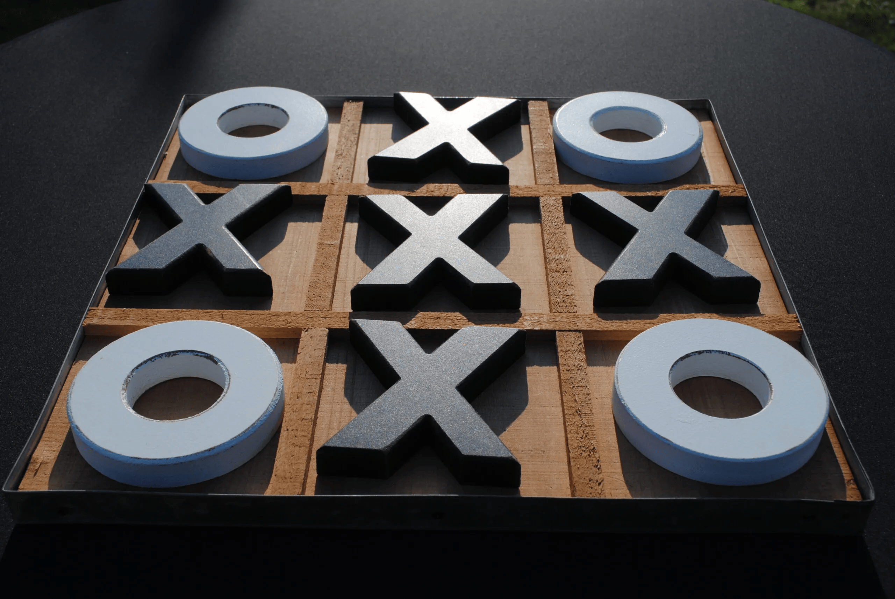

# Le tic-tac-toe
Petit jeu de morpion réalisé par l'équipe des trois aventuriers masqués.

Deux versions :
- une dans laquelle deux joueurs peuvent jouer l'un contre l'autre (main.py)
- une seconde dans laquelle un joueur affronte une IA facile (main_IA.py)

Se joue directement dans le terminal de l'ordinateur !

